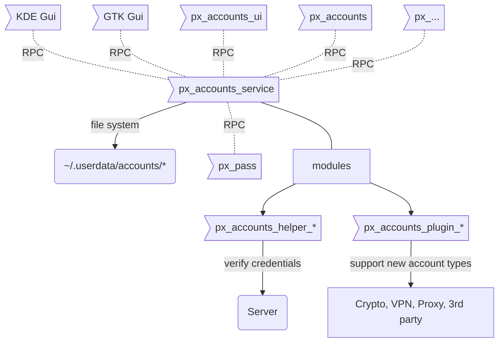

# Online Accounts Management Service

- `px_accounts_ui` **Online Accounts** ui-application (frontend, only UI)
- `px_accounts` Command line interface for **Online Accounts**
- `px_accounts_service` background-service for **Online Accounts** that serves Account related requests using _RPC_
- `px_accounts_helper_*` verify credentials **(1)**
- `px_accounts_plugin_*` support for provider & protocols

**(1)** a small helper script, that either reports `OK` or `ERROR(message)`  

## Important features

- Add, edit, delete accounts
- Save credentials with `px_pass_service`
- Keep track of account status

## Implementation

**Accounts** manages all app-related accounts such as Email, Calendar, Contacts, Matrix, IRC, Dropbox, Telegram, among others.

- Configuration is stored in `~/.userdata/accounts` (file_name: `<account-name>.yaml`)
- Credentials are stored using `px_pass_service`, via _RPC_
- Applications (ex.: `px_mail_service`) request account credentials via _RPC_ `px_pass_service`
- Add, modify or remove accounts through `px_accounts_service` using _RPC_
- `px_accounts_ui` UI for `px_accounts_service` via _RPC_

### Initially Supported Services

_All protocols and providers, will be implemented using a `px_accounts_plugin_*`_

#### Core

**by protocol / type**

- POP (1)
- IMAP
- SMTP
- CalDAV
- CardDAV
- SFTP
- OpenVPN
- Cryptocurrency (2)
  - BTC
  - ETH
  - XRP

(1) Is POP support still viable / necessary?  
(2) Initially we'll only store the currency address, and retrieve balance and transactions history.

**by provider**

(EMA)il, (CAL)endar, (CON)tacts

- Google (EMA,CAL,CON)
- Yahoo (EMA)
- FastMail (EMA,CAL,CON)
- iCloud (EMA,CAL,CON)
- Gandi (EMA)
- Office 365 (EMA,CAL,CON)
- Outlook.com (EMA,CAL,CON)

(OPE)nVPN

- TorGuard (OPE)
- AzireVPN (OPE)
- AirVPN (OPE)

## FAQ

**Q: What does the `px_accounts_ui` do?**

- Qt5 UI for `px_accounts_service`
- does not run in the background.
- send commands to  `px_accounts_service` using _RPC_ and visualize response in GUI.

**Q: What does the `px_accounts` do?**

- command line interface for `px_accounts_service`
- parse user inputs
- send commands to `px_accounts_service` using _RPC_; generate readable response for user

**Q: What does the `px_accounts_service` do?**

- read, modify and delete accounts stored in `~/.userdata/accounts`
- verify account details using 3rd-party plugins and helpers. 
- provide _RPC_ Server in order to serve received requests from other applications. 
- Keep track of account status with one of following possible states:

1. online
2. offline
3. error
4. none; never connected

The current state of an account is determined two-ways:

1. each account status is set to `none` on start-up
2. each service should report account state changes using _RPC_.

- once services come online, and syncs successfully, report _online_
- should sync fail, report _error_
- should connection fail, report _offline_