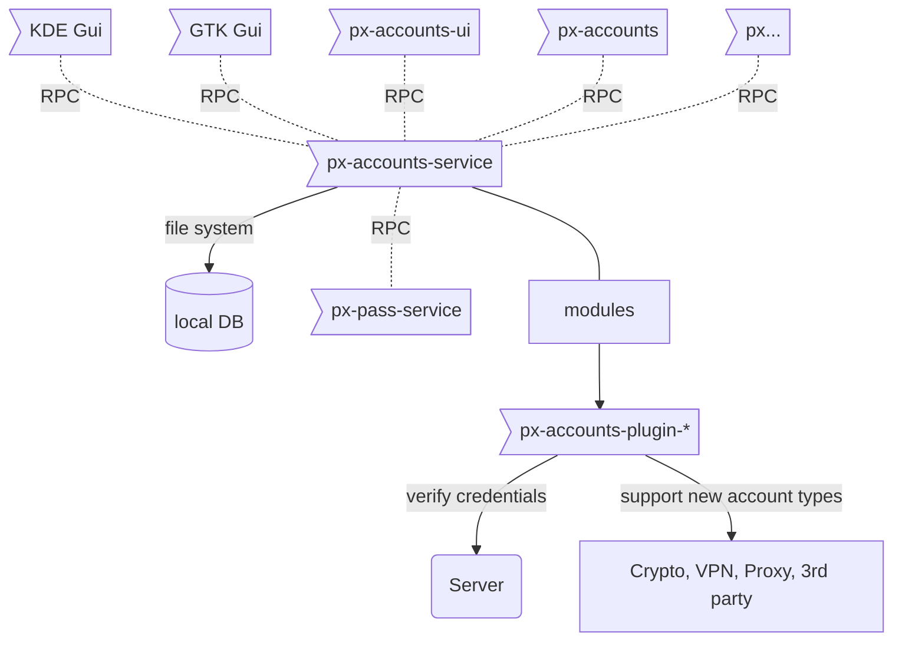
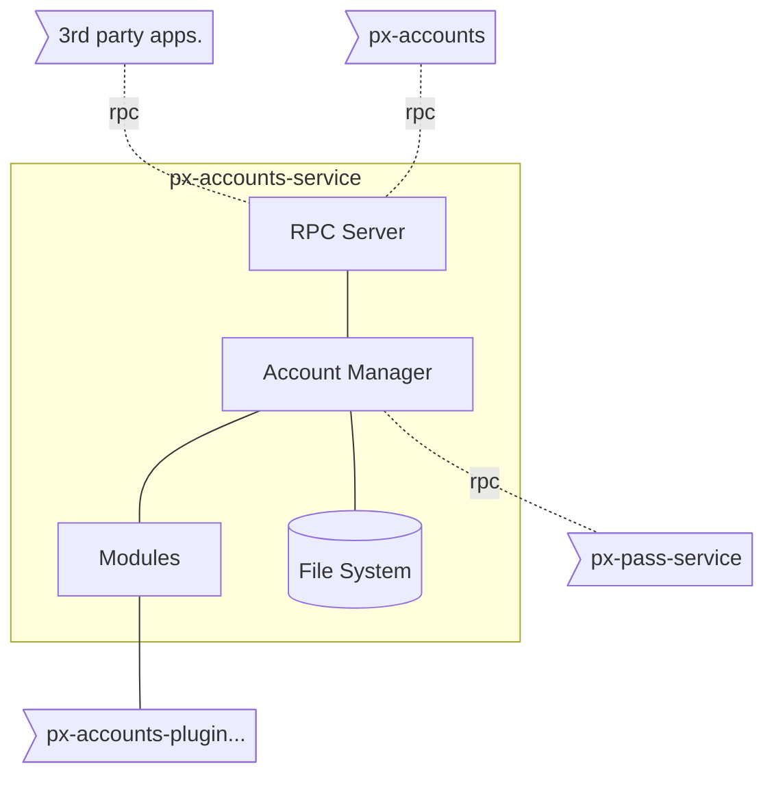

# Online Accounts Management Service

## Components

- `px-accounts-service` background-service for **Online Accounts** that serves Account related requests using _RPC_
- `px-accounts` Command line interface for **Online Accounts**
- `px-accounts-plugin-*` support for provider & protocols, verify credentials **(1)**

**(1)** a small helper script, that either reports `OK` or `ERROR(message)`  

## Important features

- RELEASED | **ACCOUNT:Cryptocurrency-ETH** [-plugin-cryptocurrency-support](https://git.pantherx.org/development/plugins/online-accounts-cryptocurrency-support) | NO-OAUTH
- RELEASED | **PROTOCOL:ETH** [-plugin-protocol-etherscan](https://git.pantherx.org/development/plugins/online-accounts-plugin-protocol-etherscan) | NO-OAUTH
- Add, edit, delete accounts
- Save credentials with `px-pass-service`
- Keep track of account status

## Usage

run service:

```bash
$ px-accounts-service
```

run service in debug mode

```bash
$ px-accounts-service -d -t console
```

add custom path to load plugin files:

```bash
$ export PLUGIN_PATH=/path/to/plugin/definition/files/
$ px-accounts-service
```

## Implementation



---

**Accounts** manages all app-related accounts such as Email, Calendar, Contacts, Matrix, IRC, Dropbox, Telegram, among others.

- Configuration is stored in `~/.local/share/px-accounts-service/accounts` (file_name: `<account-id>.yaml`)
- Credentials are stored using `px-pass-service`, via _RPC_
- Applications (ex.: `px-mail-service`) request account credentials via _RPC_ `px-pass-service`
- Add, modify or remove accounts through `px-accounts-service` using _RPC_
- `px-accounts-ui` UI for `px-accounts-service` via _RPC_

### Initially Supported Services

_All protocols and providers, will be implemented using a `px-accounts-plugin-*`_

#### Core

**by protocol / type**

- POP (1)
- IMAP
- SMTP
- CalDAV
- CardDAV
- SFTP
- OpenVPN
- Cryptocurrency (2)
  - BTC
  - ETH
  - XRP

(1) Is POP support still viable / necessary?  
(2) Initially we'll only store the currency address, and retrieve balance and transactions history.

**by provider**

(EMA)il, (CAL)endar, (CON)tacts

- Google (EMA,CAL,CON)
- Yahoo (EMA)
- FastMail (EMA,CAL,CON)
- iCloud (EMA,CAL,CON)
- Gandi (EMA)
- Office 365 (EMA,CAL,CON)
- Outlook.com (EMA,CAL,CON)

(OPE)nVPN

- TorGuard (OPE)
- AzireVPN (OPE)
- AirVPN (OPE)

## FAQ

**Q: What does the `px-accounts-ui` do?**

- Qt5 UI for `px-accounts-service`
- does not run in the background.
- send commands to  `px-accounts-service` using _RPC_ and visualize response in GUI.

**Q: What does the `px-accounts` do?**

- command line interface for `px-accounts-service`
- parse user inputs
- send commands to `px-accounts-service` using _RPC_; generate readable response for user

**Q: What does the `px-accounts-service` do?**

- read, modify and delete accounts stored in `~/.local/share/px-accounts-service/accounts`
- verify account details using 3rd-party plugins. 
- provide _RPC_ Server in order to serve received requests from other applications. 
- Keep track of account status with one of following possible states:

1. online
2. offline
3. error
4. none; never connected

The current state of an account is determined two-ways:

1. each account status is set to `none` on start-up
2. each service should report account state changes using _RPC_.

- once services come online, and syncs successfully, report _online_
- should sync fail, report _error_
- should connection fail, report _offline_ 


## `px-accounts-service` Internal Architecture:

`px-accounts-service` is responsible for following tasks:
- provide RPC interface for other applications to access online accounts.
- Add, Verify, Edit and Delete online account details using 3rd party plugins.
- hold account status details.



### `px-accounts-service` tasks:
Following tasks should be done by `px-accounts-service`:
1. get list of online accounts
2. get account details
3. add new account
4. edit account details
5. delete account
6. set account status
7. get account status

### Account Config file format:
Each Account details stores in a separated `YAML` file in `~/.local/share/px-accounts-service/accounts/` folder. structure of *Account Configuration Files* are as follows: 

```yaml

---
account:
  title: account_title
  provider: provider_name
  active: true
  settings: 
    key1: val1
    key2: val2
  services:
    - service_name:
        service_key1: service_val1
        service_key2: service_val2
...

```

here is a shord description about each account details:

 1. `title`:  represents the accounts title
 2. `provider`: if an account is created based on a provider, this parameter is set to name of provider.
 3. `active`: boolean flag that represents the whether an account is active or not.
 4. `settings`: a map of optional key-value pairs that each account might have.
 5. `services`: a map of account services, that its key represents the *service name*, and value points to other map 
of key-value pairs of *service parameters*.

 

### `px-accounts-service` communication interface:
We will provide 3 types of interfaces that are available for interacting with `px-accounts-service`.
- Account Structure that holds the details of each online account.
- Public Communication Interface that is available for all modules to communicate with `px-accounts-service` using RPC.
- Protected Communication Interface that is only available for internal Account module communications. initial design for these interfaces is as following structure:

#### 1. Online Accounts Structure: [link](https://git.pantherx.org/development/applications/px-accounts-service/blob/master/interface/Account.capnp)
 
```capnp
struct AccountInfo {
    id    @0 : Text;
    title @1 : Text;
}

struct Account {
    id       @0 : Text;
    title    @1 : Text;
    provider @2 : Text;
    active   @3 : Bool;
    settings @4 : List(Param);
    services @5 : List(Service);

    struct Service {
        name   @0 : Text;
        params @1 : List(Param);
    }

    struct Param {
        key   @0 : Text;
        value @1 : Text;
    }

    enum Status {
        none @0;
        online @1;
        offline @2;
        error @3;
    }
}
```

#### 2. Public Communication Interface. [link](https://git.pantherx.org/development/applications/px-accounts-service/blob/master/interface/AccountReader.capnp)
```capnp
using Account = import "Account.capnp".Account;
using AccountInfo = import "Account.capnp".AccountInfo;

interface AccountReader {
    list    @0 (providerFilter: List(Text), serviceFilter: List(Text)) -> (accounts: List(AccountInfo));
    get     @1 (id: Text) -> (account: Account);

    setStatus @2 (id: Text, stat: Account.Status) -> (result: Bool);
    getStatus @3 (id: Text) -> (status: Account.Status);
}
```

#### 3. Internal Communication Interface. [link](https://git.pantherx.org/development/applications/px-accounts-service/blob/master/interface/AccountWriter.capnp)
```capnp
using Account = import "Account.capnp".Account;
using AccountReader = import "AccountReader.capnp".AccountReader;

interface AccountWriter extends(AccountReader) {

   add    @0 (account: Account) -> (result: Bool, account: Account, warnings: List(Text));
   edit   @1 (id: Text, account: Account) -> (result: Bool, account: Account, warnings: List(Text));
   remove @2 (id: Text) -> (result: Bool);
}
```

#### 4. Online Accounts Events

1. _Account Status Change_
```yaml
EventData:
  topic: "account"
  source: "px-accounts-service"
  time: 12356789
  event: "account_status_change"
  params:
    -
      key: "account"
      value: "b6588a68-3ff1-4779-8ea5-f57daa0beed4"
    -
      key: "services"
      value: "svc1,svc2"
    -
      key: "from"
      value: "online"
    -
      key: "to"
      value: "offline"
```

2. _Create new account_
```yaml
EventData:
  topic: "account"
  source: "px-accounts-service"
  time: 123456789
  event: "account_create"
  params:
    -
      key: "account"
      value: "b6588a68-3ff1-4779-8ea5-f57daa0beed4"
    -
      key: "services"
      value: "svc1,svc2"
```

3. _Modify existing account_
```yaml
EventData:
  topic: "account"
  source: "px-accounts-service"
  time: 123456789
  event: "account_modify"
  params:
    -
      key: "account"
      value: "b6588a68-3ff1-4779-8ea5-f57daa0beed4"
    -
      key: "services"
      value: "svc1,svc2"
```

4. _Delete existing account_
```yaml
EventData:
  topic: "account"
  source: "px-accounts-service"
  time: 123456789
  event: "account_delete"
  params:
    -
      key: "account"
      value: "b6588a68-3ff1-4779-8ea5-f57daa0beed4"
    -
      key: "services"
      value: "svc1,svc2"
```


## Build Instructions:
1. install following libraries:
   * yaml-cpp
   * capnproto

2. get latest version from repository using following command: 
```sh
git clone https://git.pantherx.org/development/applications/px-accounts-service.git
```

3. init submodules using following command:
```sh
git submodule update --init --recursive
```

4. perform following commands:
```sh
mkdir build && cd build
cmake ..
make 
```
**Note 1:** we can configure account service during build to access account files, from a custom location. following switches are used to configure custom files: 

```bash
# set custom path for account files
$ cmake -D ACCOUNT_PATHS=/path/to/accounts/folder ..

# set custom path for readonly account files
$ cmake -D READONLY_ACCOUNT_PATHS=/path/to/readonly/accounts/folder ..
```

## Development resources:
  - [Plugin Development](https://git.pantherx.org/development/snippets/project-templates/px-accounts-service-plugin-template): template project and documents
