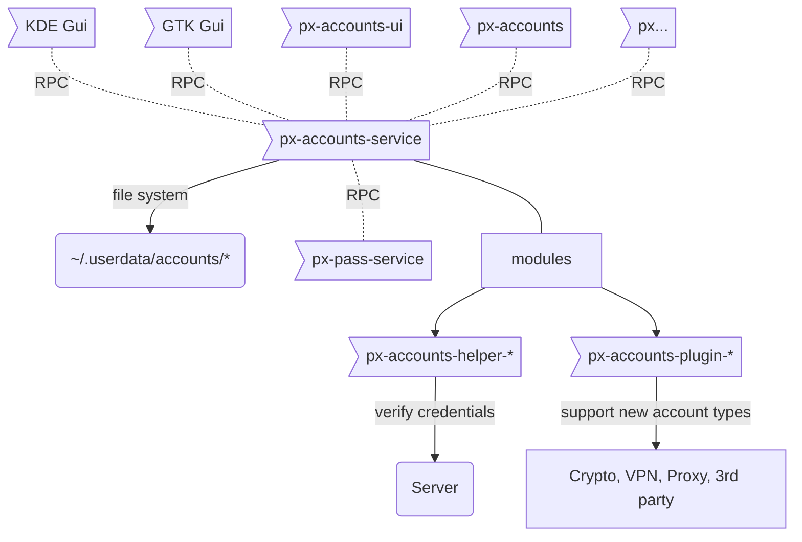
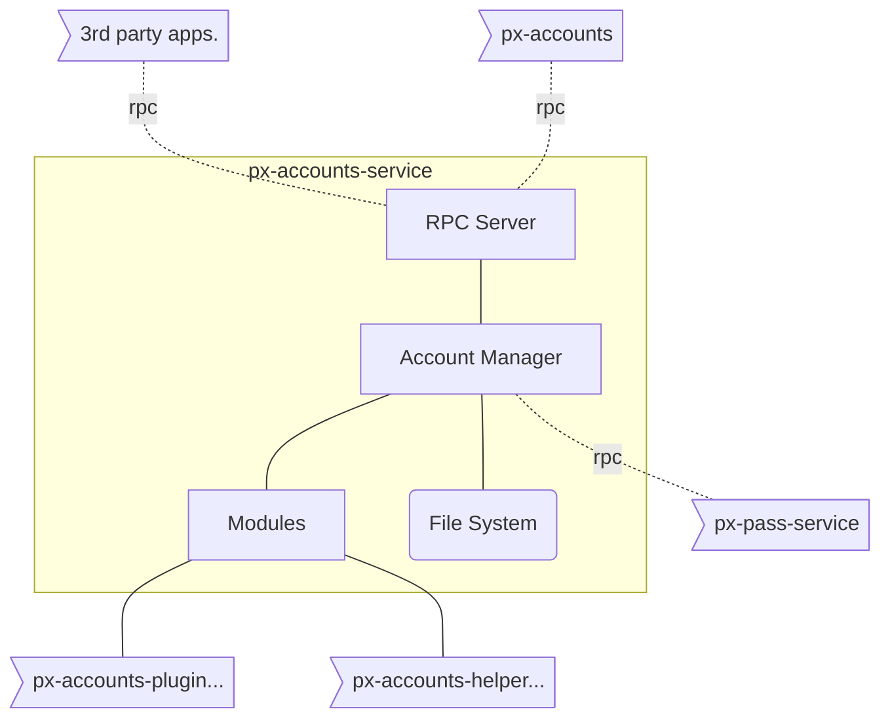

# Online Accounts Management Service

- `px-accounts-ui` **Online Accounts** ui-application (frontend, only UI)
- `px-accounts` Command line interface for **Online Accounts**
- `px-accounts-service` background-service for **Online Accounts** that serves Account related requests using _RPC_
- `px-accounts-helper-*` verify credentials **(1)**
- `px-accounts-plugin-*` support for provider & protocols

**(1)** a small helper script, that either reports `OK` or `ERROR(message)`  

## Important features

- Add, edit, delete accounts
- Save credentials with `px-pass-service`
- Keep track of account status

## Implementation



**Accounts** manages all app-related accounts such as Email, Calendar, Contacts, Matrix, IRC, Dropbox, Telegram, among others.

- Configuration is stored in `~/.userdata/accounts` (file_name: `<account-name>.yaml`)
- Credentials are stored using `px-pass-service`, via _RPC_
- Applications (ex.: `px-mail-service`) request account credentials via _RPC_ `px-pass-service`
- Add, modify or remove accounts through `px-accounts-service` using _RPC_
- `px-accounts-ui` UI for `px-accounts-service` via _RPC_

### Initially Supported Services

_All protocols and providers, will be implemented using a `px-accounts-plugin-*`_

#### Core

**by protocol / type**

- POP (1)
- IMAP
- SMTP
- CalDAV
- CardDAV
- SFTP
- OpenVPN
- Cryptocurrency (2)
  - BTC
  - ETH
  - XRP

(1) Is POP support still viable / necessary?  
(2) Initially we'll only store the currency address, and retrieve balance and transactions history.

**by provider**

(EMA)il, (CAL)endar, (CON)tacts

- Google (EMA,CAL,CON)
- Yahoo (EMA)
- FastMail (EMA,CAL,CON)
- iCloud (EMA,CAL,CON)
- Gandi (EMA)
- Office 365 (EMA,CAL,CON)
- Outlook.com (EMA,CAL,CON)

(OPE)nVPN

- TorGuard (OPE)
- AzireVPN (OPE)
- AirVPN (OPE)

## FAQ

**Q: What does the `px_accounts_ui` do?**

- Qt5 UI for `px-accounts-service`
- does not run in the background.
- send commands to  `px-accounts-service` using _RPC_ and visualize response in GUI.

**Q: What does the `px_accounts` do?**

- command line interface for `px-accounts-service`
- parse user inputs
- send commands to `px-accounts-service` using _RPC_; generate readable response for user

**Q: What does the `px_accounts_service` do?**

- read, modify and delete accounts stored in `~/.userdata/accounts`
- verify account details using 3rd-party plugins and helpers. 
- provide _RPC_ Server in order to serve received requests from other applications. 
- Keep track of account status with one of following possible states:

1. online
2. offline
3. error
4. none; never connected

The current state of an account is determined two-ways:

1. each account status is set to `none` on start-up
2. each service should report account state changes using _RPC_.

- once services come online, and syncs successfully, report _online_
- should sync fail, report _error_
- should connection fail, report _offline_ 


## `px_accounts_service` Internal Architecture:

`px-accounts-service` is responsible for following tasks:
- provide RPC interface for other applications to access online accounts.
- Add, Verify, Edit and Delete online account details using 3rd party helpers and plugins.
- hold account status details.



### `px-accounts-service` tasks:
Following tasks should be done by `px-accounts-service`:
1. get list of online accounts
2. get account details
3. add new account
4. edit account details
5. delete account
6. set account status
7. get account status

### `px-accounts-service` communication interface:
We will provide 3 types of interfaces that are available for interacting with `px-accounts-service`.
- Account Structure that holds the details of each online account.
- Public Communication Interface that is available for all modules to communicate with `px-accounts-service` using RPC.
- Protected Communication Interface that is only available for internal Account module communications. initial design for these interfaces is as following structure:

#### 1. Online Accounts Structure: [link](https://git.pantherx.org/development/applications/px_accounts_service/blob/master/interface/Account.capnp)
 
```
struct Account {
   title @0 : Text;
   provider @1 : Text;
   active @2 : Bool;
   settings @3 : List(Param);
   services @4 : List(Service);
   
   struct Service {
      name @0 : Text;
      params @1 : List(Param);
   }
   struct Param{
      key @0 : Text;
      value @1 : Text;
   }
   enum Status {
      none @0;
      online @1;
      offline @2;
      error @3;
   }
}
```

#### 2. Public Communication Interface. [link](https://git.pantherx.org/development/applications/px_accounts_service/blob/master/interface/AccountReader.capnp)
```
using Account = import "Account.capnp".Account;

interface AccountReader {
    list    @0 (providerFilter: List(Text), serviceFilter: List(Text)) -> (accounts: List(Text));
    get     @1 (title: Text) -> (account: Account);

    setStatus @2 (title: Text, stat: Account.Status) -> (result: Bool);
    getStatus @3 (title: Text) -> (status: Account.Status);
}
```

#### 3. Internal Communication Interface. [link](https://git.pantherx.org/development/applications/px_accounts_service/blob/master/interface/AccountWriter.capnp)
```
using Account = import "Account.capnp".Account;
using AccountReader = import "AccountReader.capnp".AccountReader;

interface AccountWriter extends(AccountReader) {

   add @0 (account: Account) -> (result: Bool);
   edit @1 (account: Account) -> (result: Bool);
   remove @2 (title: Text) -> (result: Bool);
}
```

## Build Instructions:
1. install following libraries:
   * yaml-cpp
   * capnproto

2. get latest version from repository using following command: 
```sh
git clone https://git.pantherx.org/development/applications/px_accounts_service.git
```

3. init submodules using following command:
```sh
git submodule update --init --recursive
```

4. perform following commands:
```sh
mkdir build && cd build
cmake ..
make 
```
